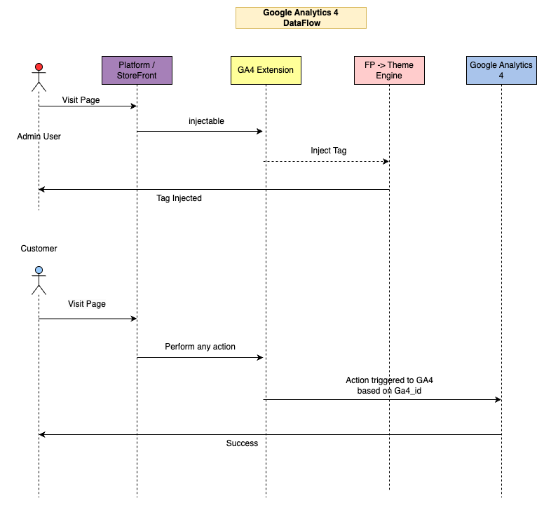

# Google Analytics Extension (GA4)

Google Analytics is one of the most popular tools for tracking website traffic and collecting visitor insights. This extension uses GA4 which is a recently launched upgraded version of Google Analytics. The tool assists you with identifying the top sources of user traffic, evaluating your marketing campaigns and activities, tracking goals (like purchases or adding products to carts), finding patterns and trends in user engagement, as well as finding demographic information about your visitors.


## Getting started

Get started with the Google Analytics Extension.



## Quick Links

| [Fynd Platform](https://platform.fynd.com/) | [Fynd Partners](https://partners.fynd.com/) | [Documentation](https://documentation.fynd.com/) |

## Prerequisites

Before setting up the extension, make sure you have the following installed:

- [Node.js](https://nodejs.org/en/download/package-manager) : >= v16.x.x
- [MongoDB](https://www.mongodb.com/try/download/community) : >= v4.4.x
- [Redis](https://redis.io/downloads/) : >= 7.0.11

---

## Project Setup

### Fynd Partners Panel

1. Register on our [Partners panel](https://partners.fynd.com/).
2. After registration, you can be added to an existing Partner Organization or you can create a new organization.
3. Once you are associated with an organization, navigate to `Extension > Create Extension > Start from scratch`, fill in the required details, and then click on the `Create Extension` button.
4. After successfully creating the extension, it will appear in the list of organization extensions. 
5. Open your extension to proceed.
6. In the Extension overview, within the 'Client Credentials' section, you will find your `API Key` and `API Secret` for further development.

### Local Setup

1. **Start MongoDB.**

   Ensure MongoDB (v4.4.x or above) is installed on your machine. Start the MongoDB service.

2. **Start Redis Server.**

   Ensure Redis is installed on your machine. Start the Redis server.

3. Use Git to clone the repository to your local machine and navigate into the project directory.

    ```bash
    git clone https://github.com/fynd-platform/GA4-Extension
    ```

4. **Install Backend Dependencies.**

   Ensure you have Node.js (v16.x.x or above) installed.

    ```bash
    npm install
    ```

5. **Install Frontend Dependencies.**

    ```bash
    cd web
    npm install
    ```

6. **Create build of frontend Vue project.**

    ```bash
    npm run build
    ```

7. **Configure Environment Variables.**

   Open the `app/fdk/config.js` file in your project directory. Update the `EXTENSION_API_KEY` and `EXTENSION_API_SECRET` environment variables in `extension.api_key` and `extension.api_secret` with the values obtained from the Partners Panel. These should be set as the default values for the `config` variables.

    ```javascript
    extension: {
        api_key: {
          doc: 'extension api key',
          default: 'Your API Key',
          env: 'EXTENSION_API_KEY',
        },
        api_secret: {
          doc: 'extension api secret',
          default: 'Your API Secret',
          env: 'EXTENSION_API_SECRET',
        },
      },
    ```

8. Also update MongoDB and Redis Environment Variables according to your machine.

9. **Secure Tunnel Setup.**

   Install ngrok or a similar cross-platform application to create secure tunnels, enabling your locally hosted web server to be accessible over the internet.

10. Launch ngrok to forward the port used by your local server.

    ```bash
    ngrok http 3000
    ```
    Replace `3000` with the actual port number your server is using. This will generate a public URL that securely tunnels to your local server.


11. Update default env value for `GA4_MAIN_DOMAIN` with this URL in `BROWSER_CONFIG.HOST_MAIN_URL`.

    ```javascript
    BROWSER_CONFIG: {
        HOST_MAIN_URL: {
          doc: 'Host Main URL',
          format: String,
          default: 'https://your-ngrok-url',
          env: 'GA4_MAIN_DOMAIN',
          arg: 'ga4_main_domain',
        },
      },
    ```

12. Navigate to your extension in the Partner Panel and update the Extension URL field with the generated ngrok URL.

13. **Run local server.**

    ```bash
    npm start
    ```

14. You are ready to go.

### Running Test Cases

After you have completed the local setup, you can run the test cases to ensure everything is working as expected. Follow these steps to execute the tests:

1. **Navigate to the Project Directory.**

   If you're not already there, switch to your project's root directory in your terminal.

    ```bash
    cd path/to/your/project
    ```

2. **Run Backend Tests.**

   Execute the backend test cases using the following command:

    ```bash
    npm test
    ```

3. **Navigate to the Frontend Directory.**

   From the root of your project, move into the web directory.

    ```bash
    cd web
    ```

4. **Run Frontend Tests.**

   Execute the Frontend test cases using the following command:

    ```bash
    npm test
    ```

Running both sets of tests ensures a comprehensive check of both the frontend and backend of your extension. We aim for over 90% test coverage to maintain a robust and reliable codebase.

### Newrelic Integration (Optional)

The Google Analytics Extension (GA4) comes pre-configured for integration with New Relic, allowing you to monitor your application's performance in real-time. This feature provides insights to help you improve and optimize your extension efficiently.

To leverage New Relic for performance monitoring, update the default values for the following environment variables in the app/fdk/config.js file in your project directory. This step ensures the New Relic integration is securely configured with your specific credentials.


1. `NEW_RELIC_APP_NAME`: Set this to the name you wish your application to appear as in New Relic. It helps easily identify your project within the New Relic dashboard.
2. `NEW_RELIC_LICENSE_KEY`: This is your unique New Relic license key, which authorizes the New Relic agent to send monitoring data to your New Relic account.

    ```javascript
      newrelic: {
        app_name: {
          doc: 'new relic app name',
          format: String,
          default: '',
          env: 'NEW_RELIC_APP_NAME',
          arg: 'new_relic_app_name',
        },
        license_key: {
          doc: 'new relic license key',
          format: String,
          default: '',
          env: 'NEW_RELIC_LICENSE_KEY',
          args: 'new_relic_license_key',
        },
      },
    ```

By updating these variables, you can activate New Relic's data collection, offering a comprehensive view of your application's performance.


### Sentry Integration (Optional)

Similar to New Relic, the Google Analytics Extension (GA4) comes pre-configured for optional integration with Sentry. Sentry provides real-time error tracking and monitoring, offering insights to quickly identify, diagnose, and fix issues, thereby enhancing your extension's reliability and user experience.

To enable Sentry for error monitoring, update the environment variables in the `app/fdk/config.js` file with your Sentry credentials:

1. `SENTRY_DSN`: This is the unique Data Source Name (DSN) provided by Sentry, which directs error messages to your Sentry project.
2. `SENTRY_ENVIRONMENT`: Specify the environment your application is running in, such as development, staging, or production. This helps in filtering and categorizing issues within Sentry.

    ```javascript
      sentry: {
        dsn: {
          doc: 'sentry url',
          format: String,
          default: '',
          env: 'SENTRY_DSN',
          arg: 'sentry_dsn',
        },
        environment: {
          doc: 'sentry environment',
          format: String,
          default: 'development',
          env: 'SENTRY_ENVIRONMENT',
          arg: 'sentry_environment',
        },
      },
    ```

Configuring these variables enables Sentry's error tracking for your application, offering a layer of insight into its stability and helping you maintain a high-quality user experience.

### Fynd Platform Panel

1. Register on our [Platform panel](https://platform.fynd.com/).
2. After registration, either join an existing Platform Organization or create a new one.
3. Upon registration completion, find your organization's ID in the URL, such as `https://platform.uat.fyndx1.de/company/:company-id/home/`.
4. For a private extension, navigate to Extension > Private Extension. Private extensions are recommended for development purposes.
5. For a public extension, navigate to Extension > Extension Marketplace.
6. Locate your extension in the list and click the `Install` button.
7. For private extensions, add the company ID as a subscriber for the extension in the Partner's Panel. Navigate to your extension in the Partner's Panel, click on the `Add Subscribers` button, enter your `company-id` in the`Subscriber Id` field, and click `Add Subscriber`.
8. After installation, your extension will be listed under your organization's extensions.
9. Click on your extension to open it.
10. Your changes from local development will be reflected here.

---

## Deployment using Docker

This section provides generic steps to deploy your Dockerized application.

### Prerequisites

- Docker installed on your local machine
- Access to a container registry (e.g., Docker Hub, GitHub Container Registry, etc.)
- Credentials configured for your container registry

### Build and Tag the Docker Image

First, build and tag your Docker image:
```bash
docker build -t your-username/your-app-name:your-tag .
```

Replace `your-username`, `your-app-name`, and `your-tag` with appropriate values.

### Push the Docker Image to a Container Registry

1. **Log in to your container registry:**

    ```bash
    docker login
    ```
    Follow the prompts to log in with your credentials.
    
2. **Push the Docker image:**

    ```bash
    docker push your-username/your-app-name:your-tag
    ```

### Deploy the Docker Image

The next steps will vary based on your deployment platform. Generally, you will follow these steps:

1. **Pull the Docker image on your deployment platform:**

    ```bash
    docker pull your-username/your-app-name:your-tag
    ```

2. **Run the Docker container:**

    ```bash
    docker run -d -p host-port:container-port your-username/your-app-name:your-tag
    ```
    Replace `host-port` and `container-port` with the appropriate port numbers.

### Example Docker Commands

Below is an example of the commands you might use for a generic deployment process:

1. **Build the Docker image:**

    ```bash
    docker build -t myusername/myapp:latest .
    ```

2. **Log in to Docker Hub (or another registry):**

    ```bash
    docker login
    ```

3. **Push the image to the registry:**

    ```bash
    docker push myusername/myapp:latest
    ```

4. **On your deployment server, pull the image:**

    ```bash
    docker pull myusername/myapp:latest
    ```

5. **Run the container:**

    ```bash
    docker run -d -p 80:3000 myusername/myapp:latest
    ```

> **Notes**
Ensure Docker is installed and configured on your deployment server, and replace `your-username`, `your-app-name`, `your-tag`, `host-port`, and `container-port` with your actual values to successfully pull images from your selected container registry.

*Security Tip:* Always verify the security of your Docker images to prevent unauthorized access.

---

## Health Check Endpoints and Container Orchestration

Our application offers several endpoints designed to monitor its health and readiness, particularly beneficial in containerized environments such as Docker or Kubernetes:


- `/_livez`: This endpoint verifies the liveness of the application, indicating whether it is running.
- `/_healthz`: It assesses the overall health of the application, including critical components like database connections.
- `/_readyz`: This endpoint confirms if the application is prepared to handle requests by checking if all initializations have successfully completed.

These endpoints provide a JSON response with an "ok" status, indicating the health status. A response of { "ok": true } signifies the application is healthy and ready, while { "ok": false } indicates an issue. This functionality ensures Kubernetes actively monitors the application's health and readiness, enhancing reliability and uptime.

---

## Contributing

Checkout [CONTRIBUTING.md](CONTRIBUTING.md) for more information on how to get started contributing to this repository.

****